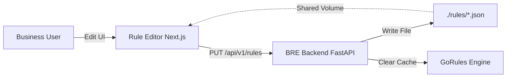

# Custom Rule Editor: User Guide & Setup

Our project now includes a custom-built, visual Rule Editor that replaces the commercial GoRules Studio. This editor allows you to manage, edit, and test business rules directly within your browser.

## 1. Quick Start

### Running with Docker (Recommended)
If you are using the provided `start-simple` scripts, the Rule Editor will start automatically.

1. Run the platform:
   ```powershell
   .\start-simple.ps1
   ```
2. Access the Rule Editor:
   - **URL**: [http://localhost:3000](http://localhost:3000)

### Running Manually (Development)
If you prefer to run the components separately:

1. **Backend**: Ensure the FastAPI server is running on port 8000.
2. **Frontend**:
   ```bash
   cd rule-editor
   npm install
   npm run dev
   ```

---

## 2. Using the Rule Editor

### Dashboard
The main page lists all business rules found in your project. Each card shows the rule name and its file path.
- Click **"Edit Rule"** to open the visual editor.
- Use the **Search bar** to quickly find specific rules.

### Visual Editor
The editor is divided into two main areas:
1. **Decision Nodes (Left)**: Navigate between the different nodes that make up your rule graph.
2. **Editor Grid (Center)**: A spreadsheet-like interface for Decision Tables.
   - **Inputs**: Defined on the left (blue headers).
   - **Outputs**: Defined on the right (green headers).
   - **Editing**: Click any cell to change its value.
   - **Rows**: Add new logic rows with the "Add Row" button.

### Live Simulation
Click the **"Test"** button in the top-right to open the simulation panel.
- **Input Facts**: Provide sample data in JSON format (e.g., customer age, score).
- **Run Test**: Instantly see how your rules process that data without saving.
- **Results**: See the final decision (`APPROVED`, `REJECTED`) and the detailed execution result.

---

## 3. How it Connects to the Backend

The system uses a decentralized architecture to ensure live updates:



- **Persistence**: When you click "Save", the Editor sends the JSON to the backend, which writes it to the local `./rules` directory.
- **Shared Storage**: Both the Backend and the Editor container share the same physical rules folder.
- **Hot Reloading**: The Backend automatically clears its internal cache when a rule is saved, so the next API call uses the new logic immediately.
